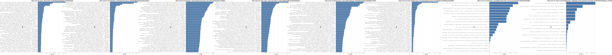

# Report: Examining YouTube Auto-generated News Playlists in Germany

> by Johannes Filter (filter@algorithmwatch.org), AlgorithmWatch, January 2022

## Introduction

As part of the [DataSkop](https://dataskop.net/) project, we investigated news videos that YouTube features on their German front page.
This report is meant to give a concise description of our data analysis
Read the full story on [algorithmwatch.org]().
All the charts are SVGs, so you can zoom in to see details.
Reach out to filter@algorithmwatch.org for questions, or take a look at the accompanying Jupyter notebooks.

## Data collection

From 29th October 2021 to 16th December 2021 we gathered data from eight news playlists from YouTube.
We used our TypeScript-based YouTube parser [harke](https://github.com/algorithmwatch/harke) with Puppeteer (Headless Chrome) (see the [README](./README.md) for details).
We scraped the data on average every 7 minutes, the server is located in Germany.

The news section is presented on the front page of YouTube (this varies among users, possible reasons: A/B testing or personlization).
There is also a special [channel](https://www.youtube.com/newucnews/featured) that links to the news playlists.
YouTube [states](https://www.youtube.com/newucnews/about) that those playlists are automatically generated.
The playlists are specific to countries and we only focus on Germany in this investigation.

The following playlists were scraped ([here are the playlists IDs](https://github.com/algorithmwatch/harke/blob/dae1829c901275357ed9654b378fc90b8c631258/src/constants.ts#L23)):

- News / Nachrichten
- National News / Nationale Nachrichten
- Sports News / Sportnachrichten
- Entertainment News / Unterhaltungsnachrichten
- Business News / Wirtschaftsmeldungen
- Science and Technology News / Meldungen aus Wissenschaft und Technik
- World News / Internationale Nachrichten
- Health News / Gesundheitsnachrichten

### Data integrity

#### Is there data missing?

We did not perform any kind of scrolling to lazy load all playlist items.
But this was not necessary since the playlists mostly contain only 16 items at maximum.
We also scraped the total number of items in the playlist (that is displayed separately next to the playlist name).
So we can calculate the number of missing items.

- No missing items: 68683
- 1 missing item: 13384
- 2 missing items: 784
- 3 missing items: 39

So for most samples, the data is complete. Some items are missing (the last items in the playlist).

### Was the scraping interval too high?

We only scraped the data every 7 minutes.
Was this enough?
To investigate this, we took a closer look at the 'news' playlists (one of the eight playlists).
The findings are similar to the others playlists.
We checked if the following sample is identical for every sample.
This is true for only 3% of the cases.
However, the average (and the mean) of the [Jaccard index](https://en.wikipedia.org/wiki/Jaccard_index) between the following samples is 0.95.
This means that the order of the items changes in the playlists, but the general fluctuation is low.
We may have skipped through some items that were present, but this would not have changed any of our results.

### Are the news playlists personalized?

With our first data donation projects ([first results of DataSkop project](https://dataskop.net/erste-ergebnisse/)), we got crowd-sourced data from over 4000 people.
We did not see any kind of personalization for the news playlist.
So we conclude that the data is identical for everybody else.

## Results

### Overall Axel Springer's "Die WELT" newspaper is dominating

About 26.5 % of videos are from "Die WELT", from the German media/tech conglomerate Axel Springer.

The distribution of channels for the eight playlists.

### Incorrectly classified

Some news videos in "Word News" are incorrect.
The second most displayed video is about national corona news "AFP Deutschland: Biontech-Chef für Corona-Booster nach 3 Monaten".
Also, the third and fourth most displayed are about German national news.
A large portion of the featured videos does not seem to fit the title "World News".

The videos that were featured the most for the eight playlists.

### Outdated News

Even though the playlists are labeled as "news", the videos listed are not always recently published.
One video about Bushido was listed almost every day over the course of the investigation.
A video about "recent corona numbers" was listed two weeks after its publication.

How to read the chart: Each column is one day, on the left is the first day of our investigation, on the right is the last day. The more blue a square is, the more often the specific video occurred in news playlists.

### Comparison to total published videos

Is "Die WELT" only so popular because they publish more videos?
To answer this question, we need to gather all the videos that the channels published over the course of the experiment.
To do so, we use the official YouTube Data API via a [Python package](https://github.com/sns-sdks/python-youtube) to get all the videos.
Then, we can see that "Die WELT" indeed published a magnitude more videos than other channels.
"Die WELT" also has a high rate of videos that were listed in relation to non-listed videos.
“tagesschau” has the highest rate but does not publish as many videos.

### Examining "Die WELT" in detail

Now we want to see if we can spot differences in the "Die WELT" videos that were listed in the news playlists and those that were not listed.
Videos that were listed get more likes and views.
We cannot say if this is due to the fact of being featured, but most likely not.
A guess: well-performing videos are automatically added to news playlists.
And: Videos under 100 seconds have a higher chance to get listed.

